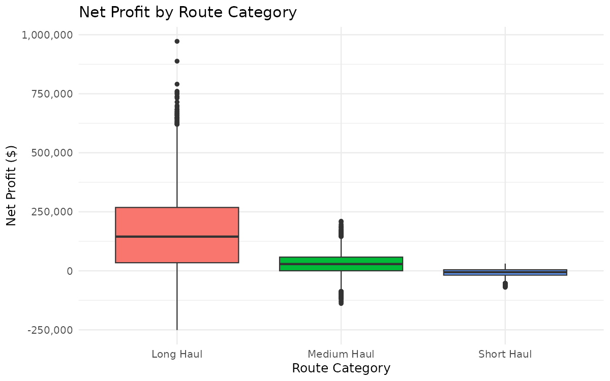
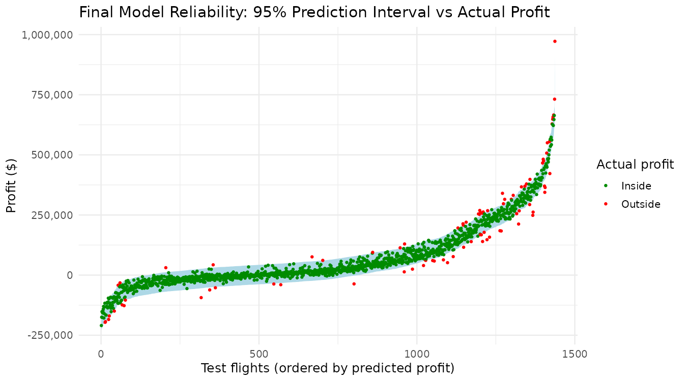

# Air Route Profitability at Dubai International Airport (DXB)

Statistical analysis and prediction of the net profit of individual flights departing from Dubai International Airport, using R.

Introduction to Statistics project, 2025/2026 — Bachelor's Degree in Artificial Intelligence, Universitat Politècnica de Catalunya (UPC).

**Authors:** Daniel Díaz Soler, Oriol Ruiz Zaballos, Cesc Colomer Aubert, Joan Prat Moreno.

> The code in this repository was reorganised in 2026 from the original course scripts. Running it on the cleaned dataset reproduces all the results below.

---

## Research questions

1. Which route categories generate the highest profits and losses?
2. Do profits differ significantly across seasons, and is the season associated with the demand level?
3. Can we predict the net profit of a flight **before it departs**, using only information available at that moment?

## Data

[Airline Route Profitability and Cost Analysis](https://www.kaggle.com/datasets/waleedfaheem/airline-route-profitability-and-cost-analysis) (Kaggle): financial and operational records of individual flights departing from DXB in 2024. The original 7,974 flights were reduced to **7,182** after removing missing values, duplicates and implausible outliers. The scripts start from this cleaned version (see [`data/README.md`](data/README.md)).

## Methodology

- **Train-test split** 80/20 with `set.seed(123)`: 5,745 training flights and 1,437 test flights.
- **Exploratory analysis:** distributions, profit by route, aircraft and season, correlation matrix.
- **Hypothesis testing:** one-way ANOVA and chi-squared test of independence.
- **Regression:** simple linear regression (Models 1–3) and multiple linear regression (Models A–C), compared with AIC.
- **Look-ahead bias:** Ancillary Revenue and Fuel Cost are only known *after* the flight, so they were replaced by predictions from auxiliary regression models trained on pre-flight variables.
- **Model refinement:** five final models to remove the multicollinearity introduced by that substitution, evaluated on the test set with MAE, RMSE, R², 95% prediction-interval coverage, AIC and VIF.
- **Diagnostics:** residuals vs fitted, residuals vs leverage and normal Q-Q plot.

## Results

### Profitability by route category

| Route category | Flights | Mean profit ($) | Loss-making flights |
|---|---|---|---|
| Long Haul | 2,913 | 159,512 | 19.6% |
| Medium Haul | 2,313 | 30,559 | 24.8% |
| Short Haul | 1,956 | −8,774 | 65.0% |



### Hypothesis tests

| Hypothesis | Test | Result | Conclusion |
|---|---|---|---|
| Profit differs by route category | One-way ANOVA | F = 1412, p < 0.001 | Significant differences |
| Profit differs by season | One-way ANOVA | F = 121, p < 0.001 | Significant differences |
| Season and demand level are associated | Chi-squared | χ² = 0.48, p = 0.92 | No association |

### Final model comparison (test set, 1,437 flights)

| Model | MAE ($) | RMSE ($) | R² test | 95% PI coverage | Avg PI width ($) | AIC (train) |
|---|---|---|---|---|---|---|
| Final 1 | 13,551 | 19,910 | 0.9793 | 0.9367 | 79,652 | 130,276.4 |
| Final 2 | 13,672 | 20,070 | 0.9790 | 0.9360 | 79,838 | 130,303.3 |
| Final 3 | 14,170 | 20,265 | 0.9786 | 0.9443 | 80,888 | 130,453.4 |
| Final 4 | 14,175 | 20,267 | 0.9786 | 0.9443 | 80,876 | 130,451.6 |
| **Final 5** | **14,168** | **20,281** | **0.9786** | **0.9415** | **80,871** | **130,451.0** |

Final Model 1 has perfectly collinear (aliased) coefficients, and Models 2–4 still have predictors with VIF above 5. **Final Model 5** was selected: it keeps almost the same accuracy with only two predictors and a VIF of 2.51.

```
Profit = −25,180 − 2.945 × Pred_Fuel + 0.8838 × Ticket_Revenue
```



### Key findings

1. **Route category is the main driver of profitability.** Long Haul flights are the most profitable but also the most volatile. Short Haul flights lose money on average, probably acting as feeders for the rest of the network.
2. **Aircraft type and season matter.** The A380 averages $228,236 per flight, while the A320 and B737-800 stay close to zero. Peak season averages $110,686 per flight versus $26,698 in Low season.
3. **Season and demand level are independent** in this dataset.
4. **Look-ahead bias changes the whole model.** Variables that look very predictive in hindsight (Ancillary Revenue, Fuel Cost) are useless if they are not available when the prediction is made.
5. **Simpler is better when accuracy is similar.** The final model uses two predictors and reaches R² = 0.979 on unseen data, with 94.15% of test flights inside their 95% prediction interval.

### Limitations

- Linear relationships are assumed, and the most extreme profits and losses are predicted less accurately (heavy tails in the Q-Q plot).
- Ticket Revenue is a direct component of profit (Profit = Revenue − Cost), so part of the high R² is structural. Using it as a pre-flight predictor also assumes most tickets are already sold at prediction time.
- A single airport and a single year (DXB, 2024), with no external factors such as oil prices, weather or competition.
- The model only applies to routes already present in the data.

## Repository structure

```
├── run_all.R                  # runs the full analysis
├── R/
│   ├── 00_setup.R             # packages, paths and plotting helpers
│   ├── 01_cleaning.R          # data loading, checks and train-test split
│   ├── 02_eda.R               # descriptive and exploratory analysis
│   ├── 03_hypothesis_tests.R  # ANOVA and chi-squared tests
│   ├── 04_regression.R        # Models 1–3 and A–C
│   ├── 05_final_models.R      # look-ahead bias, auxiliary models, Final Models 1–5
│   └── 06_evaluation.R        # final equation, prediction intervals, diagnostics
├── data/                      # dataset (see data/README.md)
├── figures/                   # all generated figures
└── outputs/                   # tables and model summaries
```

## How to run

1. Install R and the packages `ggplot2`, `corrplot` and `car`.
2. Place the dataset in `data/vols_dubai_nets.csv` (see [`data/README.md`](data/README.md)).
3. From the repository root, run `Rscript run_all.R`. Figures are saved in `figures/` and tables in `outputs/`.

## Team contributions

| Member | Main responsibilities |
|---|---|
| Daniel Díaz Soler | Data cleaning and preprocessing, derived variables, train-test split, residual diagnostics. |
| Oriol Ruiz Zaballos | Descriptive statistics and exploratory analysis, figures, final model selection and evaluation. |
| Cesc Colomer Aubert | Hypothesis tests, simple regression models, look-ahead bias detection and auxiliary models, final equation. |
| Joan Prat Moreno | Multiple regression models (A–C), AIC comparison, development of Final Models 1–5, multicollinearity diagnosis and VIF analysis, interpretation of coefficients. |
| All members | Interpretation of results, conclusions, report and oral presentations. |

## References

- Faheem, W. *Airline Route Profitability and Cost Analysis* [Dataset]. Kaggle.
- James, G., Witten, D., Hastie, T., & Tibshirani, R. (2021). *An Introduction to Statistical Learning* (2nd ed.). Springer.
- Montgomery, D. C., Peck, E. A., & Vining, G. G. (2012). *Introduction to Linear Regression Analysis* (5th ed.). Wiley.
- Fox, J., & Weisberg, S. (2019). *An R Companion to Applied Regression* (3rd ed.). Sage.
